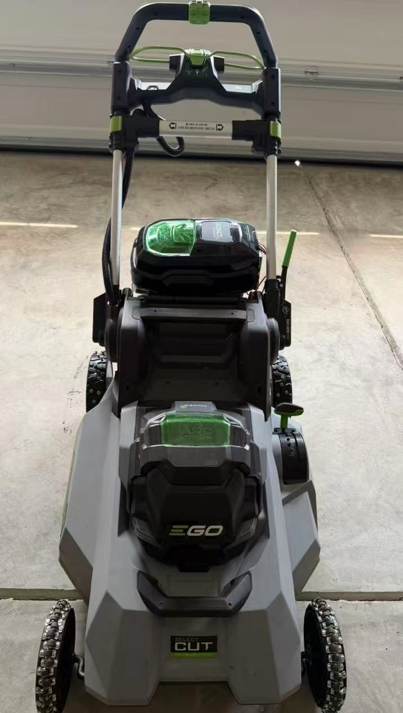
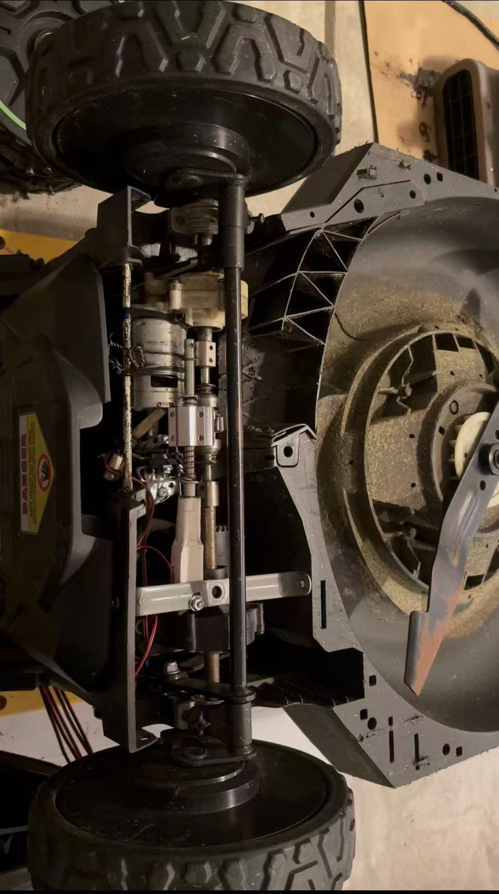
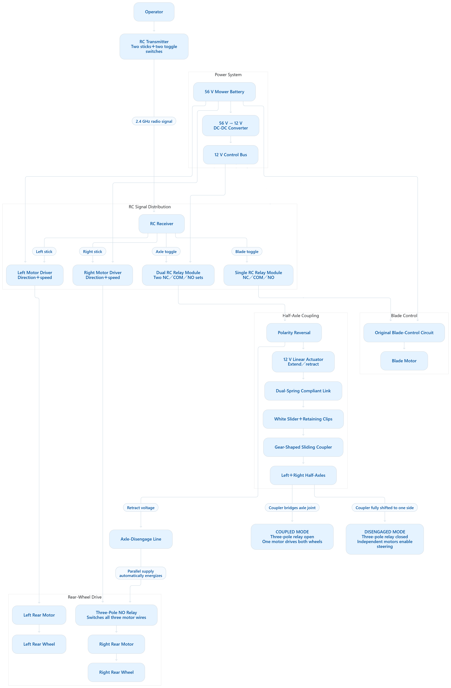
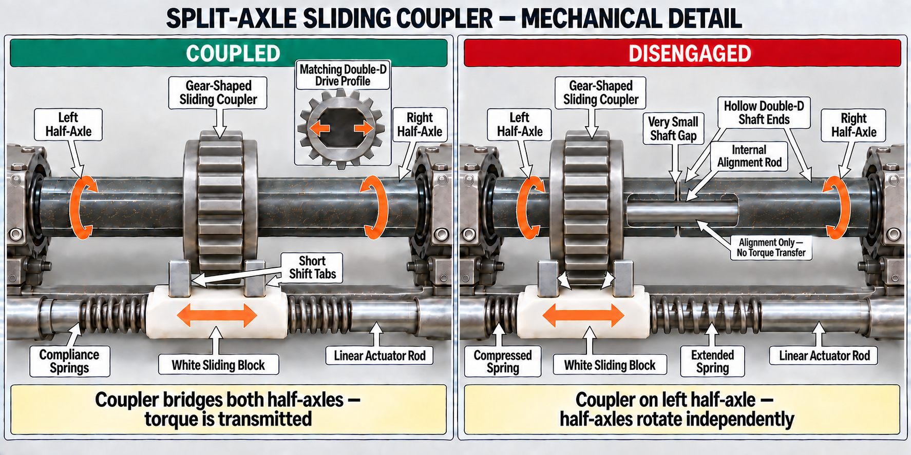
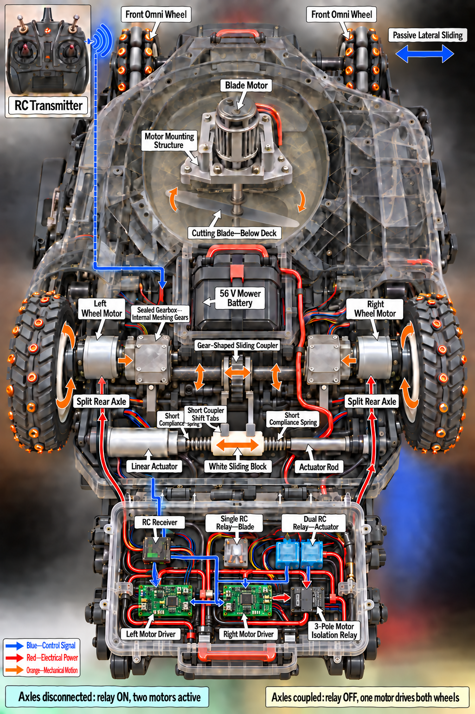
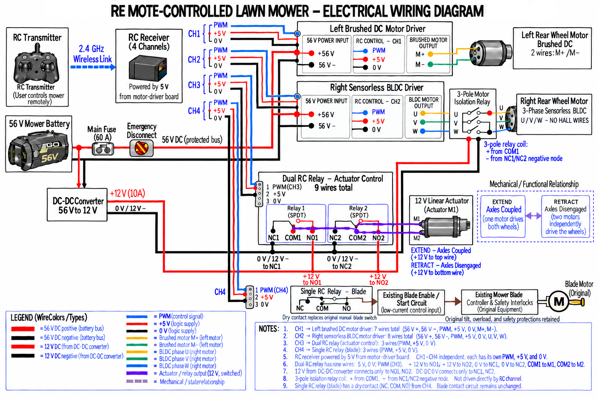

# Remote-Controlled EGO Lawn Mower Conversion

An experimental RC conversion of an EGO walk-behind electric mower, using radio-controlled drive electronics, an actuator-operated rear axle coupling, and modified front wheels. This repository documents the hardware through photographs, component references, diagrams, a bill of materials, and demonstration videos. The documentation is shared as a reference for the conversion ideas, component roles, and operating principles. The base mower was purchased several years ago, and its current market availability is unknown.

The photographs show the physical build, and the electrical diagram documents the installed wiring, as confirmed by the project builder. The other diagrams explain the control and coupling design. Product specifications and test results are distinguished from the installed wiring throughout this README.

## Project media

| Complete mower | Rear mechanism |
| --- | --- |
|  |  |

- [Mower operation video](07-operation-video/mower.mp4): approximately 2 minutes 6 seconds; shows outdoor travel and changes of heading on grass.
- [Earlier mower video](07-operation-video/earlier_mower.mp4): short outdoor clip retained under its supplied filename.
- [Rear mechanism demonstration](04-mechanical-details/gear_drive_demo.mp4): approximately 13 seconds; close-up of the rear assembly.
- [Side view](06-final-system/final_mower_side.jpg) and [front underside view](06-final-system/final_mower_part_front.jpg).
- [Original mower](01-original-mower/mower.jpg) and [original underside/drive assembly](01-original-mower/original_mower.jpg).

These recordings are qualitative demonstrations, not measured range, stopping-distance, endurance, or safety-validation tests. Filenames do not establish the revision of every component visible in a clip.

## System overview



The supplied diagrams describe four RC control functions:

1. Left rear-wheel motor direction and speed.
2. Right rear-wheel motor direction and speed.
3. Linear-actuator extension/retraction to couple or separate the rear half-axles.
4. Blade-enable/start control through the mower's existing control circuit.

The electrical drawing identifies a **left brushed DC motor and driver** and a **right sensorless three-phase BLDC motor and driver**. In coupled mode, the left drive turns both rear wheels through the coupling and the right motor's three phases are disconnected by a three-pole relay. In disengaged mode, the half-axles rotate independently and the right motor is connected for independent rear-wheel control and steering. This control arrangement is documented in the as-built electrical diagram. Exact motor and driver model numbers are not specified in the component list.

The system uses operator radio commands. No autonomous navigation, obstacle sensing, or software control implementation is included.

## Components

Source: [bill of materials](02-components/bill-of-materials.xlsx), together with the component photographs and product-reference images in `02-components/`. Product ratings below are transcribed from these supplied sources; they are not measured system ratings.

| Component | Identification / specification in the supplied files | Role and evidence limits |
| --- | --- | --- |
| EGO mower | Exact mower model not identified | Original battery-powered platform; the transmission's compatibility list does not identify this mower's model. |
| EGO self-propelled transmission | EGO Power+ 2826067001; listing names LM2130SP and LM2150SP 21-inch mowers | OEM drive-unit reference; see [product image](02-components/EGO%20Self-Propelled%20Unit%20Transmission.jpg). |
| RC transmitter | Microzone C7 Mini, 7 channels | Actual [transmitter photograph](02-components/RC%20Transmitter.jpg). The separate [alternative product reference](02-components/RC%20Transmitter_alternative_reference.jpg) depicts a Microzone 6CH product and is not the identification source for the photographed transmitter. |
| RC receiver | Microzone MC8RE, 8 channels, 2.4 GHz, HV marking, dual antennas | Actual [receiver photograph](02-components/RC%20Receiver.jpg). The wiring drawing shows four used control channels, not the receiver's total capacity. |
| Linear actuator | USLICCX LA-T8-12-FS-30/8-64; 12 V DC; listed 1.2-inch (about 30.5 mm) stroke, 64 N, 0.6 in/s (about 15 mm/s), IP54 | Moves the axle-coupling linkage; [component reference](02-components/Micro%20Electric%20Linear%20Actuator.jpg). |
| Dual-relay RC PWM switch | Q1 module with two SRD-05VDC-SL-C relays; 5 V coil markings; 10 A contact marking | Actuator polarity switching in the diagram; [component reference](02-components/RC%20Dual-Relay%20PWM%20Switch.jpg). Contact markings alone do not establish the assembled motor-load rating. |
| RC PWM switch modules | ZORZA, listed 5–12 V DC, 20 A; one pack of two | [Product reference](02-components/RC%20PWM%20Switch%20Controller.jpg). The listing does not establish that these provide the isolated dry contacts shown for blade control. |
| DC-DC converter | Listed 17–65 V DC input, 12 V DC output, 10 A / 120 W; fuse holder and 14 AWG leads | Supplies the 12 V accessory branch in the drawing; [component reference](02-components/DC-DC%20Step-Down%20Converter.jpg). |
| Red/black wire | TYUMEN 22 AWG copper parallel wire, 100-foot roll | Low-voltage wiring reference; [product image](02-components/RedBlack%20Low-Voltage%20Wire.jpg). No installed circuit-by-circuit wire schedule is included. |
| Linear bearing blocks | SCS6UU, 6 mm bore, four-piece pack | Linear-guide hardware reference; [product image](02-components/Linear%20Bearing%20Slide%20Block.jpg). Purchased quantity is not an installed count. |
| Small fixed rollers | TIESOME 1/2-inch rigid fixed casters with metal top plates | [Product image](02-components/Omni%20wheels.jpg) shows a 16-piece pack; BOM lists five packs / 80 pieces. Small rollers are mounted around the front wheel circumference in the [installation photo](03-installation/Omni%20wheels%20final%20look.jpg). |

**BOM scope:** This bill of materials lists parts purchased for the conversion. Components reused from the original EGO mower are excluded. The component overview above also includes the original mower and OEM reference information for context; these entries do not imply separate purchases. Reused components and custom mechanical assemblies are described in the system, electrical, and mechanical sections.

## Mechanical implementation

### Rear drive and coupling

The [rear assembly photograph](06-final-system/final_mower_part_rear.jpg) shows drive hardware, custom mounts, an actuator, guide hardware, and a spring-loaded sliding assembly installed across the rear underside. The [mechanism video](04-mechanical-details/gear_drive_demo.mp4) provides another view of this assembly.



The coupling drawing specifies:

- Two half-axles with matching **double-D drive profiles** and hollow facing ends.
- A **gear-shaped sliding coupler** that bridges the joint to transmit torque between the half-axles.
- A white sliding block with short shift tabs that move the coupler axially.
- Compliance springs on both sides of the block, allowing spring deflection while the drive profiles are misaligned.
- An internal alignment rod that keeps the shaft ends aligned while allowing independent rotation; the drawing labels it as an alignment feature with no torque transfer.

In the coupled position, the coupler overlaps both half-axles. In the disengaged position shown, it lies on the left half-axle and leaves the right half-axle free to rotate independently. The illustration explains how the coupling and spring-compliant linkage work.

### Front wheels

The [installation close-up](03-installation/Omni%20wheels%20final%20look.jpg) shows small fixed rollers attached around an original wheel to provide lateral rolling freedom during turns. The complete front and side photographs show roller-covered front wheels. A separate [front underside photograph](06-final-system/final_mower_part_front.jpg) shows larger caster assemblies on brackets; the archive therefore records more than one front-wheel arrangement without a dated revision history proving which is the final configuration for every demonstration.

### Overall mechanical illustration



This overview helps locate the motors, axle coupling, actuator, and control functions. Its rendered layout and wheel depiction should be read alongside the build photographs, not treated as an exact as-built drawing.

## Electrical and RC design



The project builder confirms that this diagram represents the installed wiring. It documents the motor-driver connections, receiver power, actuator relay circuit, right-motor isolation relay, and blade-control interface.

### Documented channel assignment

| Channel in wiring drawing | Operator control in block diagram | Output |
| --- | --- | --- |
| CH1 | Left stick | Left brushed DC motor driver |
| CH2 | Right stick | Right sensorless BLDC motor driver |
| CH3 | Axle toggle | Dual RC relay module for actuator polarity reversal |
| CH4 | Blade toggle | Single RC relay contact into the existing blade-enable/start circuit |

The specific stick axes, SW-A/SW-B assignment, transmitter mixing, reversal, endpoints, neutral values, binding procedure, and failsafe settings are not supplied. This table records the diagram's mapping, not a recovered transmitter configuration.

### Power paths

The electrical drawing shows a nominal **56 V mower battery**, a **60 A main fuse**, and an **emergency disconnect** feeding the motor-driver bus. A DC-DC converter supplies **12 V** for the actuator/relay power circuit. The receiver and RC logic are shown supplied with **5 V from a motor-driver board**; the receiver's HV marking is not evidence that it is connected directly to the 12 V bus.

The converter branch connects on the battery side of the main fuse and emergency disconnect shown in the as-built diagram. Opening that disconnect therefore interrupts the motor-driver bus but does not disconnect the converter input. Additional converter-branch protection is not specified in this diagram.

### Actuator and right-motor isolation

The dual SPDT relay circuit reverses the 12 V polarity across the actuator. The wiring diagram labels extension as **axles coupled** and retraction as **axles disengaged**. The three-pole relay switches all three right-motor phase wires (U/V/W); its coil is drawn from COM1 to the negative node, rather than from a separate receiver channel.

The functional diagram describes that relay as open in coupled mode and energized/closed in disengaged mode. This expresses the intended relationship between the electrical command and axle mode. No coupler-position sensor, verified transition timing, or controller configuration is supplied to prove that electrical switching occurs only after the mechanical shift completes.

### Blade interface

CH4 controls a dry-contact interface into the existing blade-enable/start circuit, followed by the original blade controller and safety interlocks, as documented in the as-built wiring diagram. The relay switches the low-current control input rather than blade-motor power. The diagram records retention of the original tilt, overload, and other safety protections; a separate test record of their operation is not included. The specific blade-interface relay model is not identified.

## Evidence, limitations, and project status

The archive supports the presence of a physical conversion, a rear actuator/coupling assembly, modified front-wheel arrangements, and outdoor movement demonstrations. The builder-confirmed as-built electrical diagram documents the installed two-drive wiring and control interfaces. Component ratings and operational test results are separate from this confirmation of wiring.

No measured radio range, travel speed, turn radius, stopping distance, current consumption, actuator cycle life, or load/slope results are included. Blade state and isolation during the outdoor recordings are not established by the visual evidence. There is no verified radio-loss response, emergency-stop test, or complete safety-interlock test report.

> [!WARNING]
> This is an experimental mower conversion, not a validated safety system. The supplied media and diagrams do not establish safe stopping, signal-loss behavior, or retention of every original protection. The wiring and mechanical illustrations document this experimental project for reference.

## File inventory

All paths below are present in the supplied archive. The component screenshots are reference material; they are distinct from photographs of the built mower.

```text
ego-rc-mower/
├── README.MD
├── LICENSE.md
├── mermaid-diagram.png
├── 01-original-mower/
│   ├── mower.jpg
│   └── original_mower.jpg
├── 02-components/
│   ├── bill-of-materials.xlsx
│   ├── DC-DC Step-Down Converter.jpg
│   ├── EGO Self-Propelled Unit Transmission.jpg
│   ├── Linear Bearing Slide Block.jpg
│   ├── Micro Electric Linear Actuator.jpg
│   ├── Omni wheels.jpg
│   ├── RC Dual-Relay PWM Switch.jpg
│   ├── RC PWM Switch Controller.jpg
│   ├── RC Receiver.jpg
│   ├── RC Transmitter.jpg
│   ├── RC Transmitter_alternative_reference.jpg
│   └── RedBlack Low-Voltage Wire.jpg
├── 03-installation/
│   └── Omni wheels final look.jpg
├── 04-mechanical-details/
│   ├── gear_drive_demo.mp4
│   ├── rc-mower-transparent-top-view.png
│   └── split-axle-sliding-coupler-detail.png
├── 05-electrical-details/
│   └── rc-mower-electrical-wiring-diagram.png
├── 06-final-system/
│   ├── final_mower_front.jpg
│   ├── final_mower_part_front.jpg
│   ├── final_mower_part_rear.jpg
│   └── final_mower_side.jpg
└── 07-operation-video/
    ├── earlier_mower.mp4
    └── mower.mp4
```

## License and attribution

Except where otherwise noted, original project documentation, photographs, diagrams, and videos are licensed under [Creative Commons Attribution-NonCommercial 4.0 International (CC BY-NC 4.0)](https://creativecommons.org/licenses/by-nc/4.0/). You may share and adapt this material for noncommercial purposes with appropriate credit, a link to the license, and an indication of changes. See [LICENSE.md](LICENSE.md) for scope and attribution details.

Third-party product images, screenshots, manufacturer materials, and trademarks are excluded from this license grant and remain subject to their respective owners' rights. Their inclusion does not grant permission to reuse them.

EGO is a trademark of its respective owner. This is an independent modification; no manufacturer affiliation or endorsement is established by these materials.
